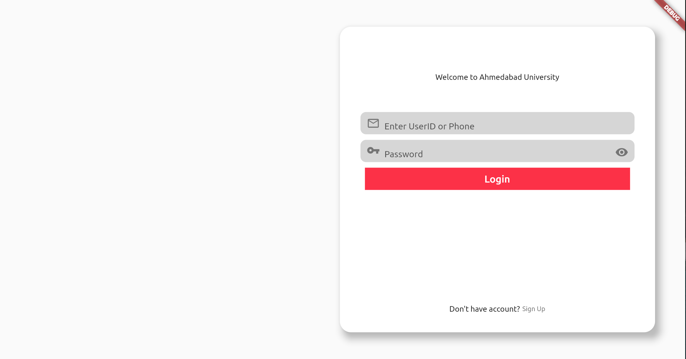
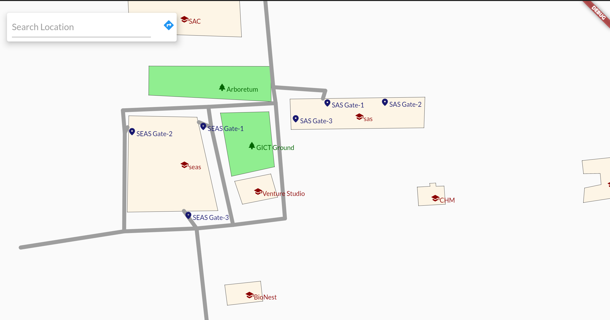
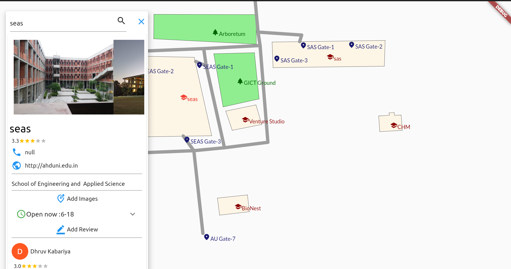
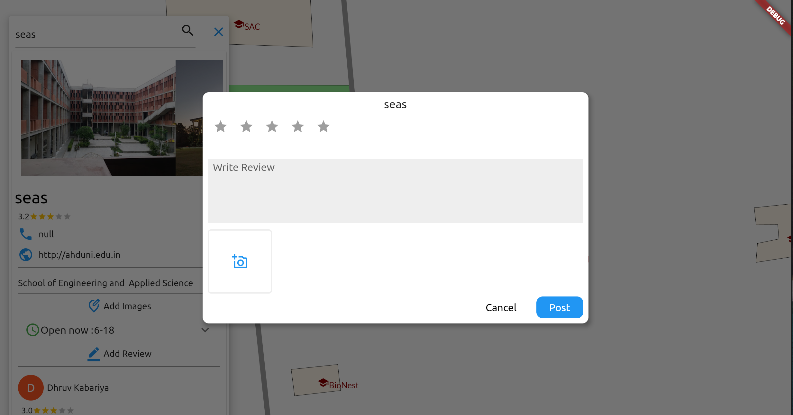
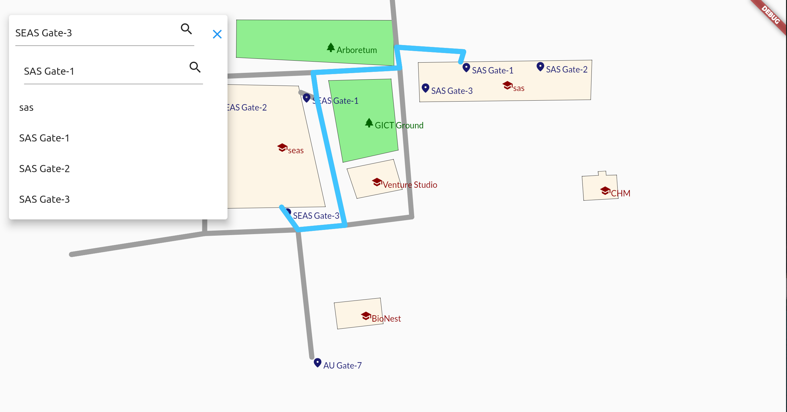

# **AU Map** - Map Of Ahmedabad University
AUMap is My DBMS Project. I buit it with my friend.

     

## Features
* Search Place
* Post Review
* Like Review
* Find Routes

### Here Look At ScreenShots  

